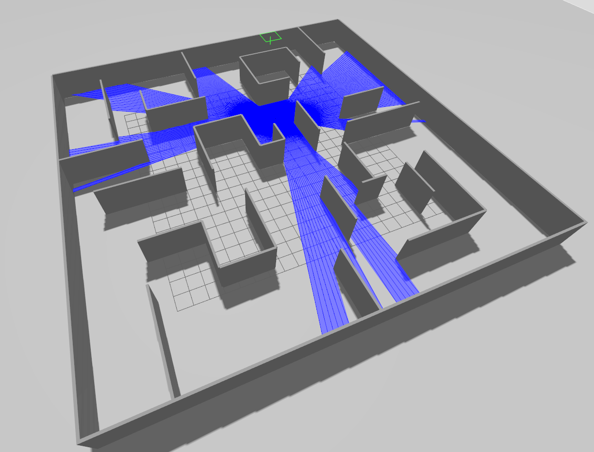

The code was inspired from the following sources:

1) https://github.com/joshnewans/articubot_one/blob/adb08202d3dafeeaf8a3691ddd64aa8551c40f78/launch/launch_sim.launch.py
2) https://github.com/joshnewans/articubot_one/commit/e8a355fe8eb52c5a40a5240347bc204350a61266

Code contain simulation in ROS2 Jazzy Jazlisco and Gazebo Hermonic. In simulation was created the mobile robot and maze. 
The main purpose of project was to implement two neural network - Convolution and Recurrention. The input data was information form 2D sensor.
The output was the velocity of robots' wheels.

To start the simulation we have to use this command:

source install/setup.bash
colcon build -- packages-select ros_gazebo_simulation
ros2 launch ros_gazebo_simulation ros_gz_sim_launch.py

