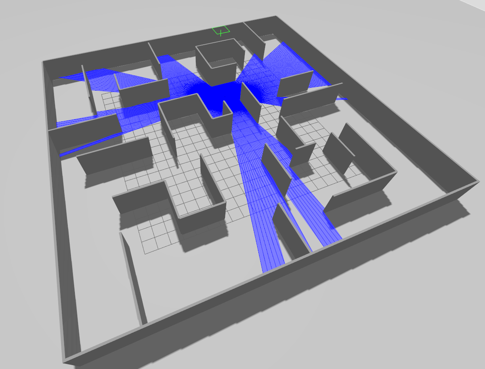

The code was inspired from the following sources:

1) https://github.com/joshnewans/articubot_one/blob/adb08202d3dafeeaf8a3691ddd64aa8551c40f78/launch/launch_sim.launch.py
2) https://github.com/joshnewans/articubot_one/commit/e8a355fe8eb52c5a40a5240347bc204350a61266

The code contain simulation of the mobile robot in ROS2 Jazzy Jazlisco and Gazebo Hermonic. The robot collect data from sennsor 2D and information about velocity. Based on this data, neural network models were trained. The main purpose of project was to implement two neural network - Convolution and Recurrention to examine their efficiency by modifying their input data.



To start the simulation we have to use the below commands:

```bash
source install/setup.bash
colcon build --packages-select ros_gazebo_simulation
ros2 launch ros_gazebo_simulation ros_gz_sim_launch.py


